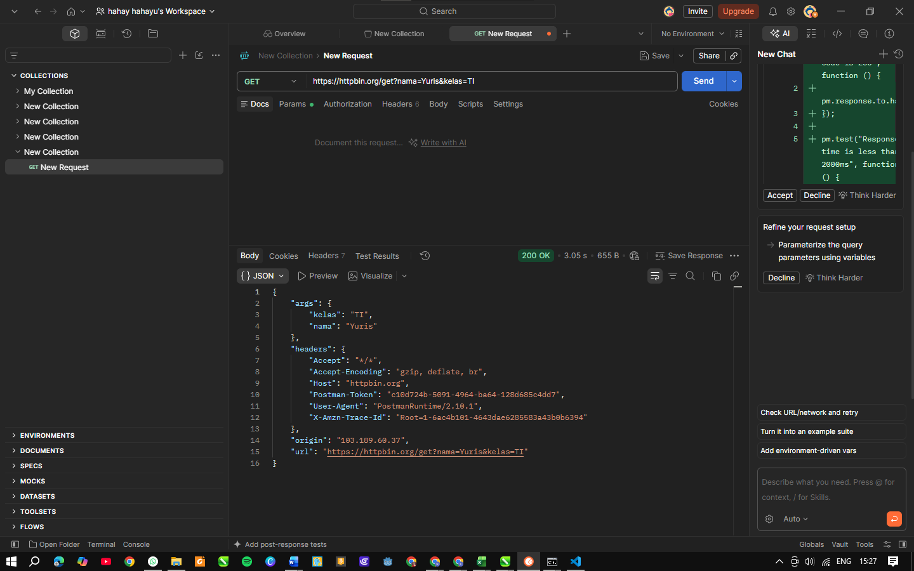
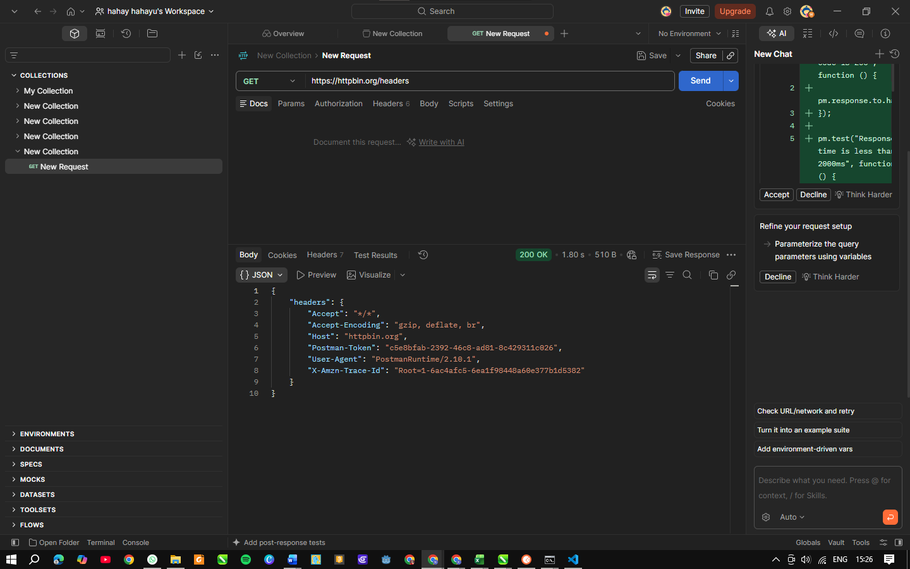

# Tugas Mandiri 3 — Memahami Request dan Response

## Pertanyaan Konseptual

1. **Apa yang dimaksud request?**
   - Request adalah data dan instruksi yang dikirimkan oleh client (seperti browser atau Postman) ke server untuk meminta suatu aksi atau data.

2. **Apa yang dimaksud response?**
   - Response adalah balasan atau hasil yang dikirimkan oleh server kembali ke client setelah memproses request tersebut.

3. **Apa fungsi query parameter?**
   - Query parameter digunakan untuk mengirimkan data tambahan melalui URL (setelah tanda `?`) yang biasanya berfungsi untuk pemfilteran, pencarian, atau paginasi data.

4. **Apa fungsi HTTP header?**
   - HTTP header berfungsi untuk membawa metadata penting tentang request atau response, seperti tipe konten (`Content-Type`), token autentikasi, dan informasi perangkat/browser (`User-Agent`).

5. **Apa perbedaan data pada URL dengan data pada request body?**
   - **Data pada URL (Query/Param):** Terlihat langsung di bilah alamat, ukurannya terbatas, dan umumnya dipakai untuk method `GET`.
   - **Data pada Request Body:** Disembunyikan di dalam paket payload (tidak tampak di URL), aman untuk data besar atau sensitif, dan lazim dipakai pada method `POST`, `PUT`, atau `PATCH`.

## Screenshot Response
/get

/headers

