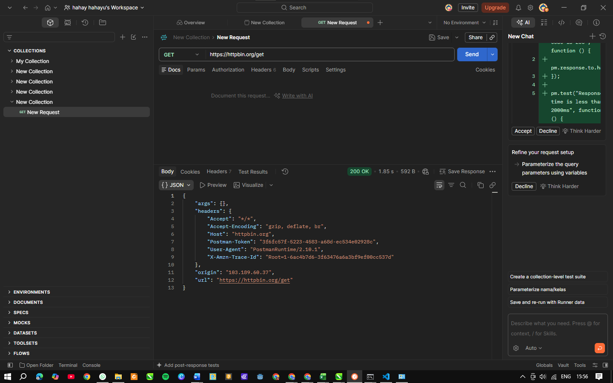
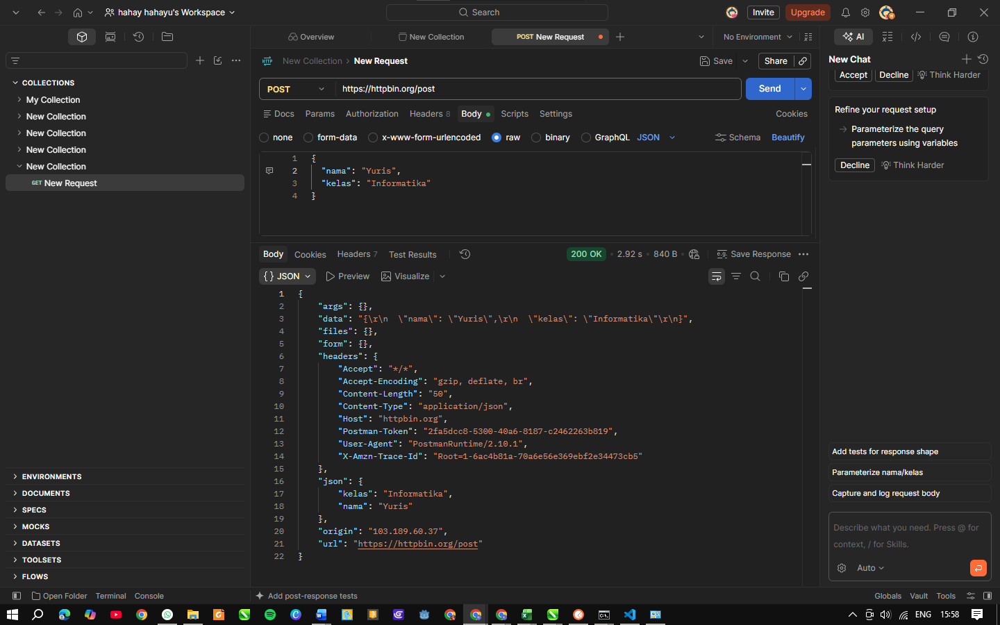
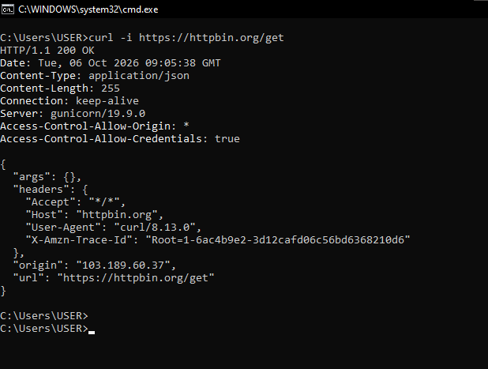
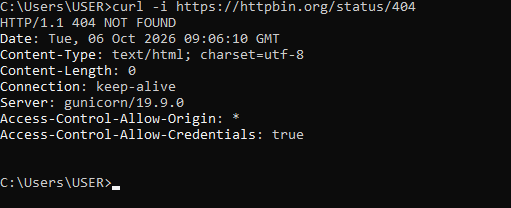
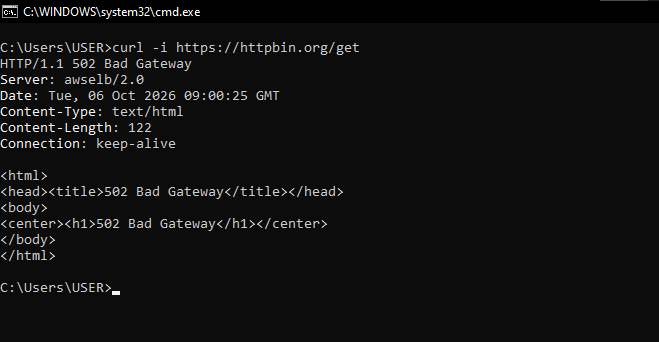
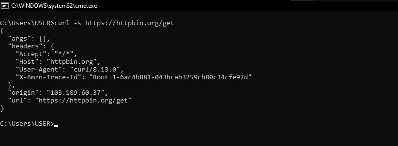

# Tugas Mandiri 4 — Pengujian API dengan Postman dan curl

## A. Pengujian Postman
- **GET (`https://httpbin.org/get`):** Mengembalikan struktur metadata request, header, dan parameter.
- **POST (`https://httpbin.org/post`):** Mengirimkan body JSON `{"nama": "Yuris", "kelas": "Informatika"}` dan server memantulkan kembali data tersebut di dalam bagian `json`.

## B. Pengujian curl
- Menjalankan `curl -i https://httpbin.org/get` menampilkan informasi HTTP header lengkap beserta body-nya.
- Menjalankan `curl -i https://httpbin.org/status/404` mengembalikan status header `HTTP/1.1 404 NOT FOUND` beserta ukuran kontennya.

## C. Membandingkan `curl -s` dan `curl -i`

1. **Apa perbedaan hasil kedua perintah tersebut?**
   `curl -s` (silent) hanya mencetak response body secara bersih tanpa menampilkan baris progres atau header tambahan, sedangkan `curl -i` (include) menampilkan informasi header HTTP secara lengkap di bagian atas sebelum body.

2. **Apa fungsi opsi `-s`?**
   Opsi `-s` berfungsi untuk menyembunyikan progress meter dan pesan error/status visual terminal sehingga output yang dihasilkan bersih.

3. **Apa fungsi opsi `-i`?**
   Opsi `-i` berfungsi untuk menyertakan HTTP response headers ke dalam hasil cetak terminal bersamaan dengan body.

4. **Kapan Anda menggunakan masing-masing opsi?**
   Gunakan `-s` saat mengambil data mentah untuk diproses otomatis (scripting/automation), dan gunakan `-i` saat proses debugging guna memeriksa header respons server secara langsung.

## Screenshot Pengujian
**Pengujian Postman**
Get

Post

**Pengujian Curl**
Curl -i Get

Curl -i status 404

**Pengujian Curl -i dan -s**
Curl -i

Curl -s

